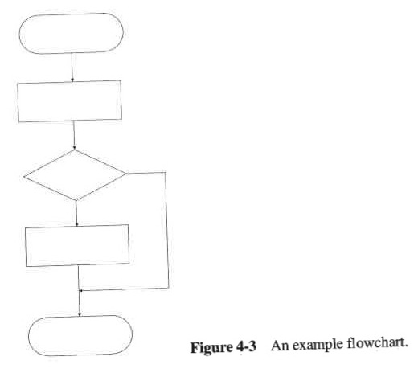

# Flow Charts
Flow charts show how the program's firmware is implemented. Multiple flow charts should be used to show how the firmware operates. Typically, a flow chart is drawn for each function created in the program. A single large flow chart is not acceptable. Each function should have a separate flow chart, e.g. \texttt{main()}. An Interrupt Service Routine (ISR) should be drawn as a normal flow chart but must have an "lightning" symbol \text{\faBolt}, at the end of the start block, to show that the ISR can occur anytime.\\

The flow chart diagram sheet is used to show the flow charts used in your stage/project. Each flow chart diagram sheet must be pasted into your workbook. Each program implemented should have at least one flow chart diagram sheet. Note a program can consist (and often do) of more than one flow chart. Each flow chart diagram sheet must have a unique ID (FID) that consists of the stage number and a unique ID for the program - e.g. F3-1 is  function 1 from Stage 3. If flow charts need to be segmented, then the flow chart FID must be used to reference the corresponding flow chart. \\

**Refer to the Miller Flowchart guide on Blackboard for the required symbols.**

## mylib
For mylib components - the mylib sheet will specify which ID prefix to use e.g. joystick mylib HAL flow chart ID starts with JH-1. Each mylib component should consist of at least one flow chart. If flow charts need to be segmented, then the flow chart ID must be used to reference the corresponding flow chart.

|  |
|:--:|
| *Figure 1: Flowchart Example [Miller]* |

## Segmentation
Flow charts should at most take up one page. It is not acceptable for a flow chart to go over a page. Any flow chart taking up more than one page should be segmented into smaller flow charts. You can then combine them to construct a higher-level flow chart by referencing their IDs.