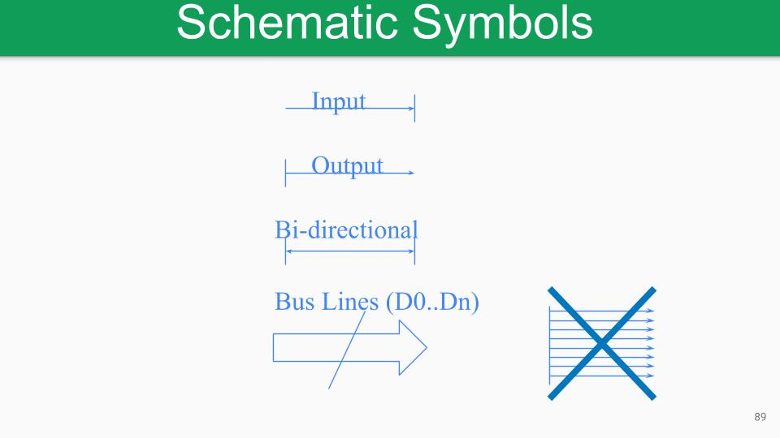
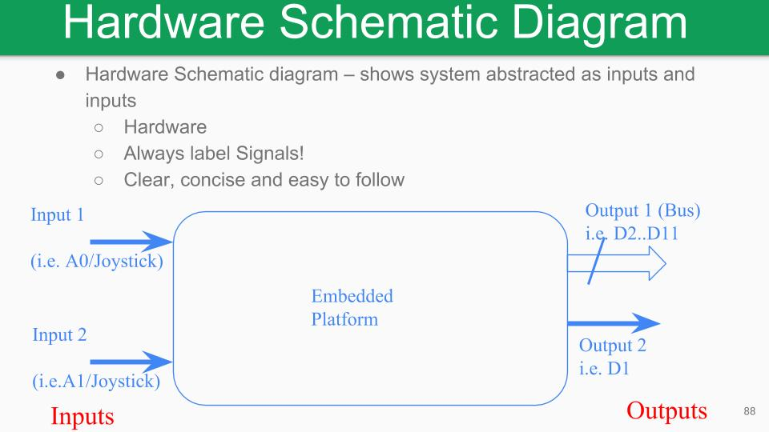

# Hardware Schematics
Hardware schematics are meant to show how you would physically implement the stage/project design. Each hardware schematic diagram sheet must be pasted into your workbook. Each hardware schematic diagram sheet must have a unique ID (HID) that consists of the stage number and a unique ID for the hardware schematic - e.g. H1-2 is hardware schematic 2 from stage 1. The HID must be used when referring to the corresponding hardware schematic in your other hardware schematic diagram sheets.

The hardware schematic should clearly show the inputs and outputs to the embedded platform and the peripherals in use. Wires or signals are represented as a single lines. A **BUS** is a collection of wires that all starts at the same peripheral and then all terminates at the same peripheral. Where possible use a double line to represent a Bus.

|  |
|:--:|
| *Figure 1: Hardware Schematic Bus Example* |

Each wire or bus must have the start and end terminals labeled, e.g. what pins are connected. You must draw peripherals with standard logic symbols and each peripheral must be labeled. The schematic must be legible and neatly drawn.

|  |
|:--:|
| *Figure 2: Hardware Schematic Example* |

## Logic Symbols
IEEE distinctive logic symbols (e.g. NOT, AND, OR, etc) must be used when drawing a block diagram. If there is no distinctive symbol used, then a rectangular symbol can be used.Refer to the IEEE Standard Symbols PDF on Blackboard.

## Segmentation
Each hardware schematic should take up a single page. If a large design takes up more than one page, you must segment your design into separate hardware schematic blocks with unique HIDs, then combine them together in an overview schematic diagram. The overview hardware schematic shows each hardware schematic as a block (with HID). There should not be wires crossing pages.\\
