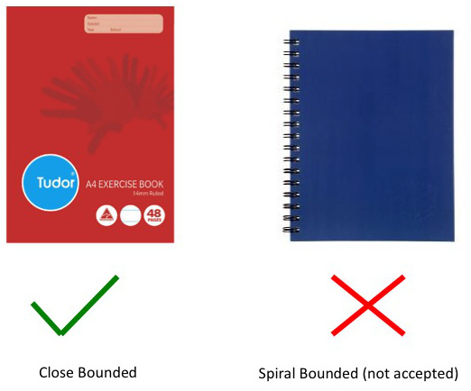

# Workbook Guide

## Workbook Overview
The workbook is an important tool in engineering development. It must be used to record key facts, features and outcomes of a project. Workbooks are also seen as legal documents that can be used as evidence, e.g. patent applications. The workbook must be used to record how you design, implement and test your stages/projects. The workbook consists of the following sections for a each stage/project:

* Stage Worksheet (printout must be fully pasted into workbook). 
* Printouts must be cut down to size and NOT folded or half pasted into the workbook.
* Stage/Project Criteria (printout pasted into workbook)
* Stage/Project Objectives (MUST BE DATED)
* Hardware Schematic Diagram sheets using the Hardware Schematic Template
* Program Flow Charts using the Flow Chart Template
* Operating State Diagrams (if required) using the State Diagram Template
* Testing Procedure
* Results and Conclusions

## Workbook Format and Use
The workbook must be an A4 sized closed bound book, not spiral bound. Spiral bound books are NOT accepted. The workbook must only be used for the stages and projects. It MUST not be used for other purposes.

|  |
|:--:|
| *Figure 1: Acceptable and Not Acceptable Workbooks* |

## Stage Worksheet and Criteria
The stage worksheet must be printed and pasted into your workbook. The criteria must also be printed and pasted into your workbook (from stage worksheet). The criteria is used to record your marks for the stage.

## Objectives
State the objectives of the stage/project. You should clearly state in one to five points what the end deliverables of the stage/project are. This should be derived from the stage/project description and tasks. This section must be dated.

## Templates

* Schematic
* Flowcharts
* State Diagrams

## Testing
Your design must be tested to show it meets the objectives of the stage/project. This can be done by applying certain test patterns, e.g. Hamming sequences or using an instrument (Logic Analyser) to view an output. You should briefly outline how you will test your design and what tools you will use.

## Results and Conclusions
You must state if your design was successful or not. You should also outline if there were any significant outcomes, problems or new facts that you need to be aware of.